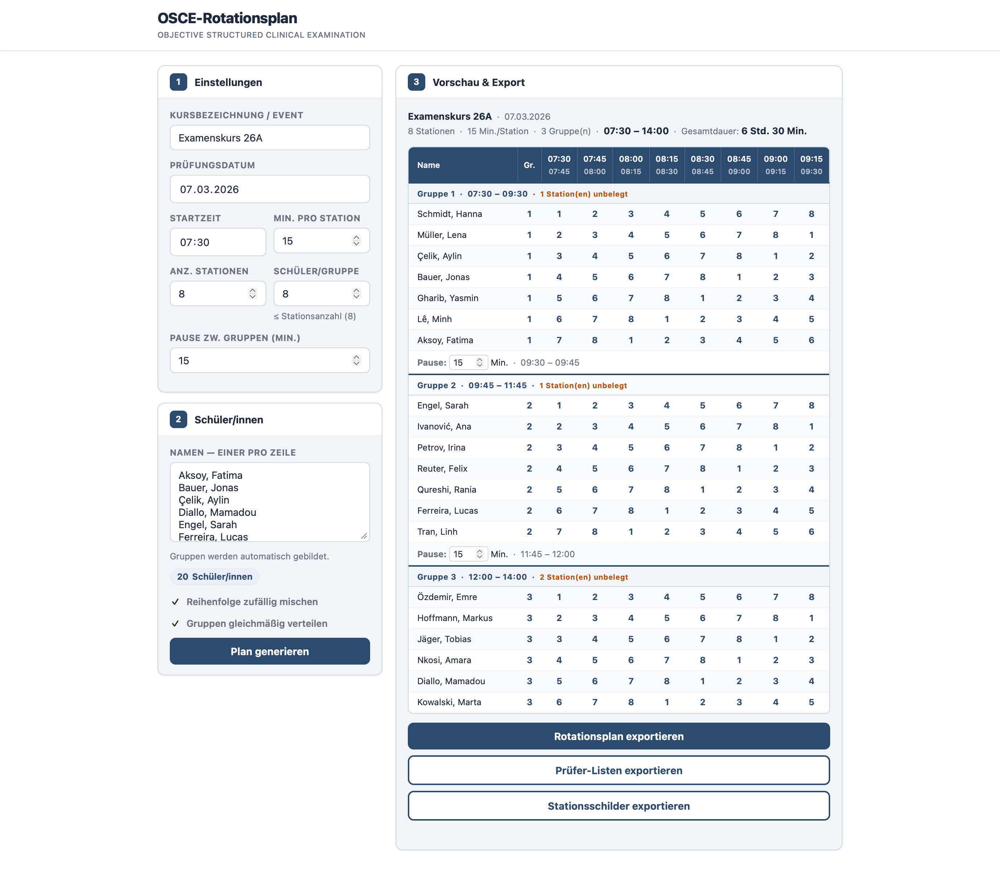
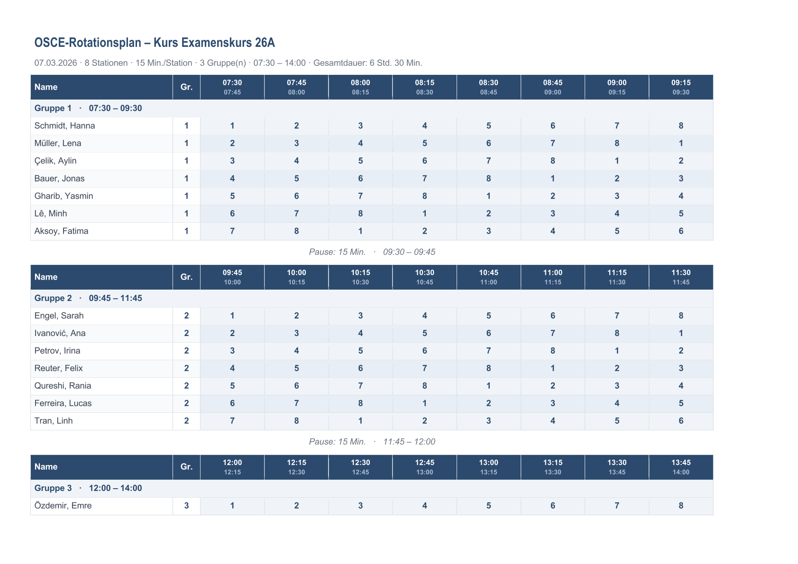
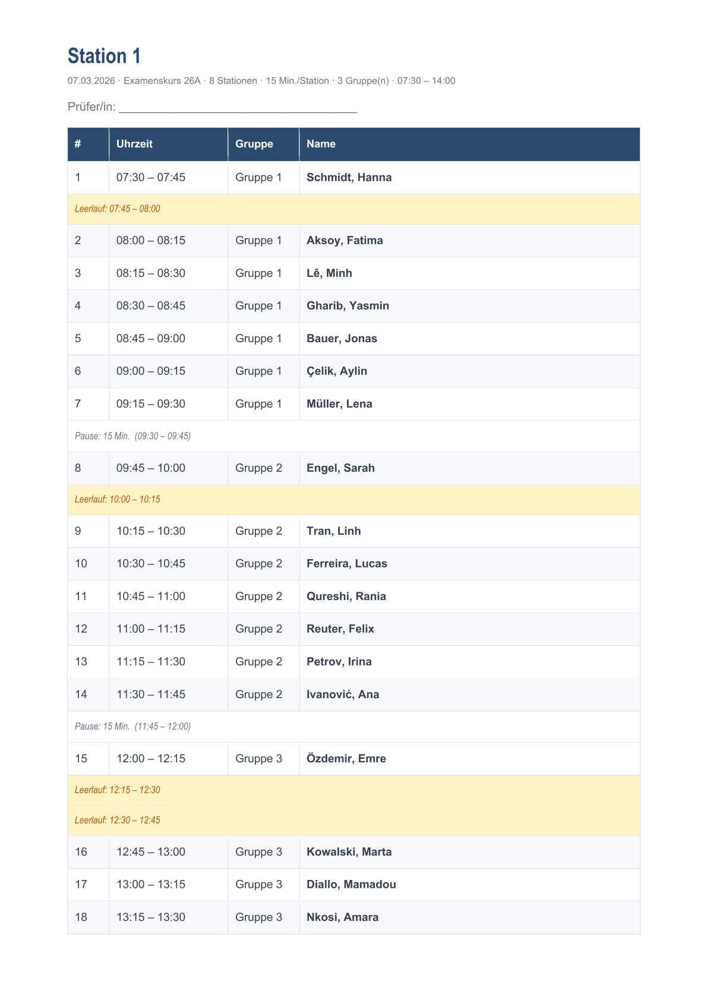

# OSCE-Planer

**Rotationspläne für OSCE-Prüfungen erstellen – automatisch, exportierbar, offline**

Hier klicken zum Ausprobieren: [index.html](https://florianloyns.github.io/osce-planer/index.html)

*Oberfläche: Einstellungen, Schülerliste und Vorschau mit editierbaren Pausenzeiten*

---

> Ein schlankes Werkzeug für die Planung von OSCE-Prüfungen in der generalistischen Pflegeausbildung – mit automatischer Rotationslogik, drei Word-Exporten und editierbaren Pausenzeiten. Alles in einer einzigen HTML-Datei, ohne Installation, offline nutzbar.

---

## Inhalt

- [Worum geht es](#worum-geht-es)
- [Was es kann](#was-es-kann)
- [Die drei Exporte](#die-drei-exporte)
- [Rotationslogik](#rotationslogik)
- [Schnellstart](#schnellstart)
- [Technisches](#technisches)

---

## Worum geht es

OSCE-Prüfungen (Objective Structured Clinical Examination) erfordern eine präzise Rotationsplanung: Wer prüft wen, wann, an welcher Station? Bei mehreren Gruppen und unterschiedlichen Gruppengrößen wird das schnell unübersichtlich.

Dieses Tool übernimmt die Rotationsplanung automatisch – nach einem Latin-Square-Algorithmus, der sicherstellt, dass jede Schülerin und jeder Schüler jede Station genau einmal durchläuft. Die fertige Planung lässt sich in drei verschiedenen Word-Dokumenten exportieren: für die Gesamtübersicht, für die Prüfer und für die Stationsbeschilderung.

## Was es kann

- **Automatische Rotationsplanung** nach Latin-Square-Algorithmus
- **Gleichmäßige Gruppenverteilung** – z. B. 18 Schüler auf 3 Gruppen à 6 statt 8 + 8 + 2
- **Zufällige Reihenfolge** per Shuffle-Funktion (optional)
- **Editierbare Pausenzeiten** – jede Gruppenpause einzeln anpassbar, Folgezeiten aktualisieren sich live
- **Drei Word-Exporte** mit automatischen Dateinamen (Rotationsplan, Prüfer-Listen, Stationsschilder)
- **Schülernamen per Paste aus Excel** einfügen – mit Live-Zähler und Eingabevalidierung
- Vollständige **Zeitberechnung** mit Start- und Endzeit sowie Gesamtdauer

## Die drei Exporte

| Export | Format | Für wen |
|---|---|---|
| **Rotationsplan** | Querformat A4 | Koordination – Gesamtübersicht aller Gruppen |
| **Prüfer-Listen** | Hochformat A4, eine Seite pro Station | Prüfer – wer kommt wann, Leerlauf-Zeiten sichtbar |
| **Stationsschilder** | Querformat A4 | Aushang – Stationsnummer + Hinweis „Bitte Ruhe" |

### Rotationsplan
Jede Gruppe erhält eine eigene Tabelle mit Kopfzeile (Zeitfenster), Gruppenheader und Schülerzeilen. Zwischen den Gruppen erscheinen die Pausenzeiten kursiv und in Grau.

*Word-Export: Rotationsplan im Querformat mit Gruppenübersicht und Zeitfenstern*

### Prüfer-Listen
Pro Station eine Seite. Listet alle Prüfungszeiträume chronologisch mit Schülername, Gruppe und Uhrzeit. Leerlauf-Slots und Pausenzeiten zwischen Gruppen werden separat ausgewiesen.

*Word-Export: Prüfer-Liste pro Station mit chronologischem Ablauf und Leerlauf-Anzeige*

### Stationsschilder
Je ein Schild pro Station (mit Hinweis „Eintreten erst nach Signalton") plus Zusatzschilder: „Prüfung – Bitte Ruhe", „Pausenraum – Prüfer/innen" und „Aufenthalt – Auszubildende".

## Rotationslogik

Die Rotation folgt einem **Latin-Square-Prinzip**: Schülerin `r` ist in Zeitfenster `s` an Station `(r + s) mod n`. Damit durchläuft jede Person jede Station genau einmal, und keine Station ist doppelt belegt.

Bei aktivierter gleichmäßiger Verteilung werden die Gruppen so aufgeteilt, dass die Differenz zwischen größter und kleinster Gruppe minimal ist (maximal 1 Schüler Unterschied).

## Schnellstart

1. [`index.html`](index.html) herunterladen oder [online testen](https://florianloyns.github.io/osce-planer/index.html)
2. Im Browser öffnen – funktioniert lokal ohne Server
3. Einstellungen vornehmen, Schülernamen eintragen, Plan generieren
4. Pausenzeiten bei Bedarf anpassen, dann exportieren

## Technisches

Eine einzelne HTML-Datei – kein Build, kein Framework, kein Server, keine externen Abhängigkeiten. Läuft vollständig im Browser, auch offline.

- Keine Datenübertragung, kein Tracking (DSGVO-konform)
- Word-Export als natives OOXML (.docx) – keine externe Bibliothek
- ZIP/OOXML vollständig in purem JavaScript implementiert (CRC32, stored compression)
- Kompatibel mit Microsoft Word, LibreOffice und Google Docs
- Responsive Layout (Desktop + Mobilgeräte) mit Druckstylesheet

**Weg vom handgeschriebenen Rotationsplan, hin zur automatisierten OSCE-Planung.**
